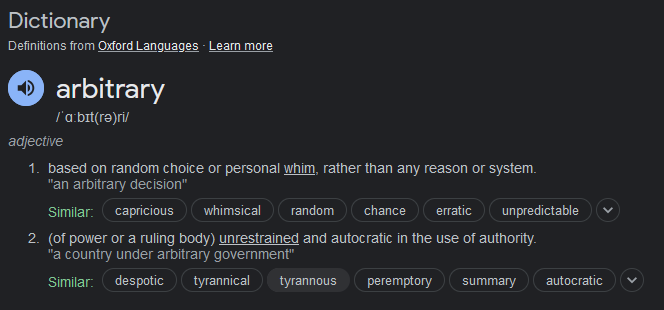
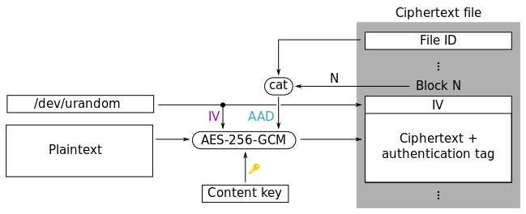

# taurus-minio
This is an application that encrypts incoming data and uploads it to the given minio bucket. The data is encrypted using `AES-256` with `GCM` inspired by [gocryptfs](https://nuetzlich.net/gocryptfs/forward_mode_crypto/).

>Developed and Tested on Windows10 and Docker Engine v24.0.7

## Usage

### Configuration
The configuration uses TOML format in the file `config.toml`. The file format is:

- endpoint `string` endpoint for minio
- accessKeyID `string` value for minio access key
- secretAccessKey `string` value for minio secret access key
- useSSL `bool` value for SSL option
- bucketName `string` value for bucket name
- encryptionKey `string` encryption key in hex format written in string of 64bytes(`hex`) or 32 bytes(`string`)
- chunking `bool` option if the files will be uploaded in chunks

The `config.toml` contains an example with example keys. `NEVER UPLOAD THE REAL KEYS`.
> Restart the application after configuration changes
### Build and Run
After completing the `configuration.toml` and before starting the main application run to start minio container from the main folder
```console
docker-compose up -d
```

Finally start the full application
```console
go run .
```


### Upload
Files can uploaded to the `/upload/file` endpoint. An example command
```console
curl --location 'endpoint:8080/upload/file' \
--form 'upload=@"PATH_TO_FILE"' \
```
<!-- --form 'chunk-size="1MB"' -->

To upload a file with chunk-size of 1 MB you could run a command:
```console
curl --location 'localhost:8080/upload/file' \
--form 'upload=@"taurus-minio/uploads/big.txt"' \
--form 'chunk-size="1MB"'
```


### Download
File download can be done to the `/file/:filename` endpoint.
Files can be downloaded with the following command
```console
curl <endpoint>:8080/file/<filename> -O -J
```

Example for downloading file `big.txt`
```console
curl localhost:8080/file/big.txt -O -J
```

# Design Choices
## Large file handling

This task required the application to support files of arbitrary size.


This meant that a tyrannous user could upload a very large file and the application should be able to handle it. However, this application required files to be encrypted and saving big files on the disk, even temporarily would hinder the performance as it is not very efficient.

To combat this issue, the application uses data streams of IO readers when passing data and never storing the full file in memory. Thus, the file is started to be processed as soon as the block of it is received.

Such feat is accomplished using golang `io.Pipe` which creates a `reader` and a `writer` which communicate with each other. The `writer` encrypts/decrypts and writes the data as long as it is able to receive raw-data from a file and the `reader` passes the data to the end destination.

## API endpoints

To simplify the access to the API [gin](github.com/gin-gonic/gin) web framework was used. The file download would be done by `GET` request and the upload would be done by `POST` request to the gin router endpoint.

## Cipher

All the encryption is performed in the `encryption` package. It uses `AES-256` with `GCM`. The main idea of file storage is based upon the image from [gocryptfs](https://nuetzlich.net/gocryptfs/forward_mode_crypto/).


### Encryption
The encryption process is as follows:

1. At the start of each each file being uploaded, we generate a 16 byte `File ID` and write it at the start of the file. 
2. For each block of a fixed size we generate an `IV` of 12 Bytes which is written to the encrypted file as well as used for encryption.
3. The IV is used for encryption and `File ID` alongside with `block number` are used for encryption as additional data or `AAD`.
4. The encrypted data is then written to the storage at the very end.

This gives us per file encryption.

### Decryption

The decryption is performed as follows:
1. Once the file has begun downloading, fetch first 16 bytes of data and store them as `File ID`.
2. Then keep a track of blocks read so far as `block number` and use it for decryption.
3. Read block by block. For each block first read the 12 bytes of `IV` stored before each block.
4. Using the `IV` and `block number` and `File ID` are used to decrypt. The `block number` and `File ID` are used as additional data(`AAD`) for `AES-256 GCM` decryption.
5. Serve the decrypted data to the user

### AES GCM
The integrity is preserved by the additional data (`block number` and `File ID`). This additional data is used for preserving file integrity when encrypting/decrypting with `AES-256 GCM`

## File Chunks
The design behind file chunking is not very exquisite solution. It relies on a simple naming scheme. Moreover, current approach is susceptible to chunk renaming, or in other words file content reordering.

The name is derived by simply appending string `_chunk{#id}` to the end of the file name. For example if we have `image.png` split into 3 chunks it would be named in the storage as `image.png_chunk0`, `image.png_chunk1`,`image.png_chunk2`.

### Uploading chunks

First of all, whenever file is uploaded the parameter `chunk-size` is passed in the `form-data` as a string. It takes integer values for the number part and `B, KB, MB, GB, TB, PB` parts for the size part.

Then the file is read until chunk size is reached. Once the full size of chunk is filled, we begin creating a new chunk. `NOTE`, the chunk is never read in full, it is uploaded as any single file using data stream.
Since we have per file encryption, encrypting each chunk file is simple.

Each chunk will have small encryption overhead of up to 28 bytes. It is achieved by: ` 28Bytes = 12Bytes (IV size) + 16Bytes(GCM Tag)`. In rare cases where `chunk-size` < `44Bytes 12Bytes (IV size) + 16Bytes(GCM Tag)+ 16Bytes(File ID)`, the chunk overhead is up to 44 Bytes. However these are relatively low. Moreover, using such small chunks for big files is not recommended as it is not efficient.

### Downloading chunks

When downloading chunks, the chunks are fetched by filename and `_chunk{#id}` part is added. The list of all available chunks is returned from `minio`, although, it can only return up to `1000` file names, and that is the current chunk number limitation of this application.

#### Parallel Chunk Retrieval
Once the chunk count is established the number of routines is started to download chunks in parallel. The chunks can be downloaded in parallel, however, they must be delivered in order.

So the routines are split up amongst which chunk files can they download and they do not start to download new chunk until their current downloaded chunk is processed. This is accomplished with go channels.

For example we have 7 chunks and 3 routines the work distribution is:
```
routine1 is responsible for chunks : 1,4,7
routine2 is responsible for chunks : 2,5,
routine3 is responsible for chunks : 3,6
```
The download is done:
```routines {1,2,3} download chunks {1}{2}{3}
# All routines downloaded and block until chunk {x} is delivered
deliver chunk {1}
routine {1} download chunk{4}
deliver chunk {2}
routine {2} download chunk{5}
deliver chunk {3}
routine {3} download chunk{6}
deliver chunk {4}
routine {1} download chunk{7}
deliver chunk {5}
deliver chunk {6}
deliver chunk {7}
```

Once a routine delivers it can start downloading its next chunk while some other earlier routine is delivering. Currently routines only download 1 chunk at a time, however, this could theoretically be increased, but is yet to be tested.


## Error Handling
The current application handles most of the errors by crashing if something goes wrong, like integrity errors or invalid options. This is something that is yet to be fixed for expanding it later

## Tested files
These are the files and their sizes the app was tested for
|       	| Size  	| Upload Time 	| Download Time 	|
|-------	|-------	|-------------	|---------------	|
| Small 	| 4B    	| 0.17s       	| 0.001s        	|
| Big   	| 4KB   	| 0.06s       	| 0.001s        	|
| Image 	| 3MB   	| 0.2s        	| 0.02s         	|
| Exe   	| 130MB 	| 3.38s       	| 0.83s         	|
| Zip   	| 5.1GB 	| 136s        	| 37s           	|

The tests could be expanded more, however, all of these yielded correct roundtrip result aka, the files contained the same content.
## Drawbacks and TODOs

### Chunk naming
I don't think the chunk naming scheme I chose is good, therefore, it should be reworked. 

### Long file names
If a long file name is given and using chunks the naming method would not work.

### Slow file upload
The upload of the files is currently slow as parsing each chunk is done in a single function call. This could further be parallelized in a future work.

### Chunk Reordering 
This is an encryption error/weakness that I noticed as I am finishing this document. For example, in the current implementation, if an attacker gains access to the bucket and renames the chunk files, the algorithm would not know that, as blockIDs are currently per chunk and not per whole file.

Iterating over `block number` per whole file rather than per chunk would be the fix

### Better error handling

Handle errors in a way that does not terminate the application

### More unit tests

Currently the unit tests are only there for encryption module as it required some testing while developing the app to ensure nothing breaks.

### Benchmark

Benchmark the application, to understand upload/download speeds, number of concurrent users. This would also help to improve the app performance later.
